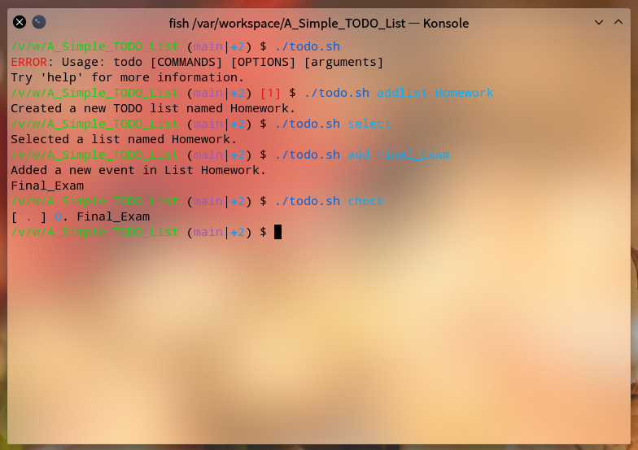
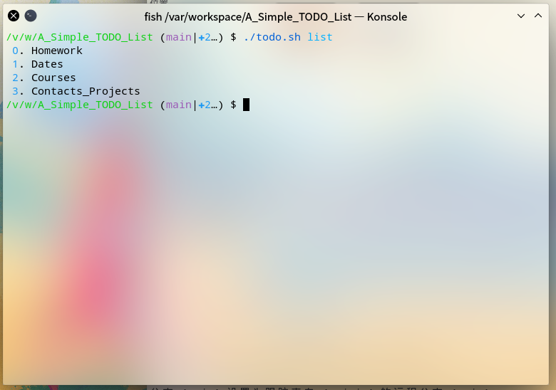
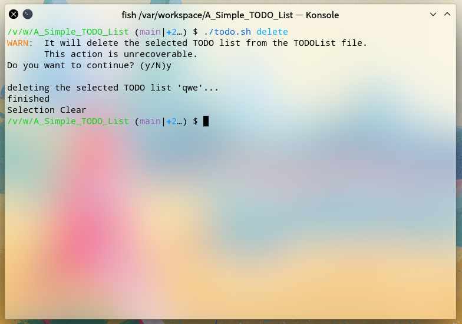

 

## A Simple TO-DO List

> 一个简单的命令行版 TO-DO List App,使用Bash脚本实现

### First Time

下载Git目录中的[todo.sh](https://github.com/arxim-lab/A_Simple_Todo_list/raw/main/todo.sh)文件，放置到任意文件夹下。

> 需要一个支持Bash的环境来运行这个脚本文件，比如任意的Linux发行版、MacOS、WSL、Git Bash等。~~尚未测试Windows PowerShell对脚本的兼容性~~

### Usage

可通过`./todo.sh help`指令查看帮助信息

- `addlist ListName` 添加一个名为ListName的TO-DO list

  list名称只能包含大小写英文字母、数字、英文短横线`-`以及英文下划线`_`！

- `select ListName` (快捷指令:`s`) 选择名为ListName的TO-DO list

  在对TO-DO list内事件的操作前必须先进行选择操作，可单独使用`select`或`s`查看当前选中的list

- `add SthToDo` (快捷指令:`a`) 在当前list内添加一条事件，内容为SthToDo

- `check` (快捷指令:`ck`) 查看当前list内所有的事件

- `done TodoID` (快捷指令:`d`) 标记当前list内ID为TodoID的事件为已完成

  TodoID为执行check指令后对应事件前标注的数字

- `clear` 彻底删除当前list内所有已完成的事件

- `delete` 彻底删除已选中的整个list

- `list` 查看本地保存的所有list

- `editraw` 使用VIM打开数据文件 (手动编辑)

- `help` 查看该帮助信息

### Screenshots

### Known Issues

- 事件内容不能包含空格，否则会导致事件录入错误或显示错误 `2020.1.2`
- 假如list中存在同名事件，clear时会被一并清除 `2020.1.2`

### TO-DOs

- [ ] 修正：脚本帮助信息
- [ ] 修正：改check的快捷指令为c
- [ ] 完善程序功能：delete、clear等
- [ ] 添加新功能：自动安装&自动卸载
- [ ] 添加新功能：备份功能
- [ ] 添加新功能：无给派指令时执行check操作
- [ ] 添加新功能：事件执行倒计时&执行时限（deadline功能）
- [ ] 修复BUG：事件内容不能包含空格
- [ ] 修复BUG：同名事件会被删除

### Update Information

- v0.0.1_20200102 - First Version
  - 第一个版本